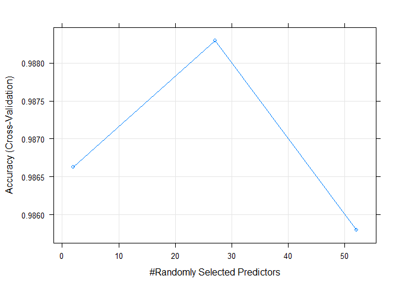

# Exercise Quality Model
Fabian Hertwig  
3 Juli 2016  


#Introduction

*From Assignment Page:*

Using devices such as Jawbone Up, Nike FuelBand, and Fitbit it is now possible to collect a large amount of data about personal activity relatively inexpensively. These type of devices are part of the quantified self movement – a group of enthusiasts who take measurements about themselves regularly to improve their health, to find patterns in their behavior, or because they are tech geeks. One thing that people regularly do is quantify how much of a particular activity they do, but they rarely quantify how well they do it. In this project, your goal will be to use data from accelerometers on the belt, forearm, arm, and dumbell of 6 participants. They were asked to perform barbell lifts correctly and incorrectly in 5 different ways. More information is available from the website here: http://groupware.les.inf.puc-rio.br/har (see the section on the Weight Lifting Exercise Dataset).

*Information on the classes:*

tl;dr Class A is the correct execution of the weight lifting exercise, the rest contains one common mistake in weight lifting.

Six young health participants were asked to perform one set of 10 repetitions of the Unilateral Dumbbell Biceps Curl in five different fashions: exactly according to the specification (Class A), throwing the elbows to the front (Class B), lifting the dumbbell only halfway (Class C), lowering the dumbbell only halfway (Class D) and throwing the hips to the front (Class E).

Read more: http://groupware.les.inf.puc-rio.br/har#weight_lifting_exercises#ixzz4DNoxHBP0

#Summary
In the data were a lot of variables which had a lot of NAs. These were removed. Also the classes were a little bit unbalanced, so they were downsampled to be balanced again. Also variables which seemed to be unrelated to the classification goal were removed, as timestamps and usernames.
Next, a  random forest model  was trained using cross valdiation to tune the number of randomly selected predictors parameter.  Finaly an accuracy over 98% was achieved validated by the out of sample error estimation by the cross validation during training and on unseen data.

#Repoducible Research

```r
library(caret)
```

```
## Loading required package: lattice
```

```
## Loading required package: ggplot2
```

```r
library(parallel)
library(doParallel)
```

```
## Loading required package: foreach
```

```
## Loading required package: iterators
```

```r
library(randomForest)
```

```
## randomForest 4.6-12
```

```
## Type rfNews() to see new features/changes/bug fixes.
```

```
## 
## Attaching package: 'randomForest'
```

```
## The following object is masked from 'package:ggplot2':
## 
##     margin
```

```r
set.seed(42)

sessionInfo()
```

```
## R version 3.3.1 (2016-06-21)
## Platform: x86_64-w64-mingw32/x64 (64-bit)
## Running under: Windows 10 x64 (build 10586)
## 
## locale:
## [1] LC_COLLATE=German_Germany.1252  LC_CTYPE=German_Germany.1252   
## [3] LC_MONETARY=German_Germany.1252 LC_NUMERIC=C                   
## [5] LC_TIME=German_Germany.1252    
## 
## attached base packages:
## [1] parallel  stats     graphics  grDevices utils     datasets  methods  
## [8] base     
## 
## other attached packages:
## [1] randomForest_4.6-12 doParallel_1.0.10   iterators_1.0.8    
## [4] foreach_1.4.3       caret_6.0-70        ggplot2_2.1.0      
## [7] lattice_0.20-33    
## 
## loaded via a namespace (and not attached):
##  [1] Rcpp_0.12.5        formatR_1.4        nloptr_1.0.4      
##  [4] plyr_1.8.4         tools_3.3.1        digest_0.6.9      
##  [7] lme4_1.1-12        evaluate_0.9       nlme_3.1-128      
## [10] gtable_0.2.0       mgcv_1.8-12        Matrix_1.2-6      
## [13] yaml_2.1.13        SparseM_1.7        stringr_1.0.0     
## [16] knitr_1.13         MatrixModels_0.4-1 stats4_3.3.1      
## [19] grid_3.3.1         nnet_7.3-12        rmarkdown_0.9.6   
## [22] minqa_1.2.4        reshape2_1.4.1     car_2.1-2         
## [25] magrittr_1.5       scales_0.4.0       codetools_0.2-14  
## [28] htmltools_0.3.5    MASS_7.3-45        splines_3.3.1     
## [31] pbkrtest_0.4-6     colorspace_1.2-6   quantreg_5.26     
## [34] stringi_1.1.1      munsell_0.4.3
```


#Data Analysis
A short summary of what is done:

- download and load the files
- get an overview of the data and interesting collumns
- removed columns with a lot of NAs in the training or test dataset
- removed columns that semed to be unrelated to the classification goal (eg. timestamps, usernames)
- balanced the classes


```r
#Download files
if(!file.exists("pml-training.csv")){
  download.file("https://d396qusza40orc.cloudfront.net/predmachlearn/pml-training.csv", "pml-training.csv")
}
if(!file.exists("pml-testing.csv")){
  download.file("https://d396qusza40orc.cloudfront.net/predmachlearn/pml-testing.csv", "pml-testing.csv")
}

training_source <- read.csv("pml-training.csv")
testing_quiz <- read.csv("pml-testing.csv")

#Overview
dim(training_source)
```

```
## [1] 19622   160
```

```r
colnames(training_source)
```

```
##   [1] "X"                        "user_name"               
##   [3] "raw_timestamp_part_1"     "raw_timestamp_part_2"    
##   [5] "cvtd_timestamp"           "new_window"              
##   [7] "num_window"               "roll_belt"               
##   [9] "pitch_belt"               "yaw_belt"                
##  [11] "total_accel_belt"         "kurtosis_roll_belt"      
##  [13] "kurtosis_picth_belt"      "kurtosis_yaw_belt"       
##  [15] "skewness_roll_belt"       "skewness_roll_belt.1"    
##  [17] "skewness_yaw_belt"        "max_roll_belt"           
##  [19] "max_picth_belt"           "max_yaw_belt"            
##  [21] "min_roll_belt"            "min_pitch_belt"          
##  [23] "min_yaw_belt"             "amplitude_roll_belt"     
##  [25] "amplitude_pitch_belt"     "amplitude_yaw_belt"      
##  [27] "var_total_accel_belt"     "avg_roll_belt"           
##  [29] "stddev_roll_belt"         "var_roll_belt"           
##  [31] "avg_pitch_belt"           "stddev_pitch_belt"       
##  [33] "var_pitch_belt"           "avg_yaw_belt"            
##  [35] "stddev_yaw_belt"          "var_yaw_belt"            
##  [37] "gyros_belt_x"             "gyros_belt_y"            
##  [39] "gyros_belt_z"             "accel_belt_x"            
##  [41] "accel_belt_y"             "accel_belt_z"            
##  [43] "magnet_belt_x"            "magnet_belt_y"           
##  [45] "magnet_belt_z"            "roll_arm"                
##  [47] "pitch_arm"                "yaw_arm"                 
##  [49] "total_accel_arm"          "var_accel_arm"           
##  [51] "avg_roll_arm"             "stddev_roll_arm"         
##  [53] "var_roll_arm"             "avg_pitch_arm"           
##  [55] "stddev_pitch_arm"         "var_pitch_arm"           
##  [57] "avg_yaw_arm"              "stddev_yaw_arm"          
##  [59] "var_yaw_arm"              "gyros_arm_x"             
##  [61] "gyros_arm_y"              "gyros_arm_z"             
##  [63] "accel_arm_x"              "accel_arm_y"             
##  [65] "accel_arm_z"              "magnet_arm_x"            
##  [67] "magnet_arm_y"             "magnet_arm_z"            
##  [69] "kurtosis_roll_arm"        "kurtosis_picth_arm"      
##  [71] "kurtosis_yaw_arm"         "skewness_roll_arm"       
##  [73] "skewness_pitch_arm"       "skewness_yaw_arm"        
##  [75] "max_roll_arm"             "max_picth_arm"           
##  [77] "max_yaw_arm"              "min_roll_arm"            
##  [79] "min_pitch_arm"            "min_yaw_arm"             
##  [81] "amplitude_roll_arm"       "amplitude_pitch_arm"     
##  [83] "amplitude_yaw_arm"        "roll_dumbbell"           
##  [85] "pitch_dumbbell"           "yaw_dumbbell"            
##  [87] "kurtosis_roll_dumbbell"   "kurtosis_picth_dumbbell" 
##  [89] "kurtosis_yaw_dumbbell"    "skewness_roll_dumbbell"  
##  [91] "skewness_pitch_dumbbell"  "skewness_yaw_dumbbell"   
##  [93] "max_roll_dumbbell"        "max_picth_dumbbell"      
##  [95] "max_yaw_dumbbell"         "min_roll_dumbbell"       
##  [97] "min_pitch_dumbbell"       "min_yaw_dumbbell"        
##  [99] "amplitude_roll_dumbbell"  "amplitude_pitch_dumbbell"
## [101] "amplitude_yaw_dumbbell"   "total_accel_dumbbell"    
## [103] "var_accel_dumbbell"       "avg_roll_dumbbell"       
## [105] "stddev_roll_dumbbell"     "var_roll_dumbbell"       
## [107] "avg_pitch_dumbbell"       "stddev_pitch_dumbbell"   
## [109] "var_pitch_dumbbell"       "avg_yaw_dumbbell"        
## [111] "stddev_yaw_dumbbell"      "var_yaw_dumbbell"        
## [113] "gyros_dumbbell_x"         "gyros_dumbbell_y"        
## [115] "gyros_dumbbell_z"         "accel_dumbbell_x"        
## [117] "accel_dumbbell_y"         "accel_dumbbell_z"        
## [119] "magnet_dumbbell_x"        "magnet_dumbbell_y"       
## [121] "magnet_dumbbell_z"        "roll_forearm"            
## [123] "pitch_forearm"            "yaw_forearm"             
## [125] "kurtosis_roll_forearm"    "kurtosis_picth_forearm"  
## [127] "kurtosis_yaw_forearm"     "skewness_roll_forearm"   
## [129] "skewness_pitch_forearm"   "skewness_yaw_forearm"    
## [131] "max_roll_forearm"         "max_picth_forearm"       
## [133] "max_yaw_forearm"          "min_roll_forearm"        
## [135] "min_pitch_forearm"        "min_yaw_forearm"         
## [137] "amplitude_roll_forearm"   "amplitude_pitch_forearm" 
## [139] "amplitude_yaw_forearm"    "total_accel_forearm"     
## [141] "var_accel_forearm"        "avg_roll_forearm"        
## [143] "stddev_roll_forearm"      "var_roll_forearm"        
## [145] "avg_pitch_forearm"        "stddev_pitch_forearm"    
## [147] "var_pitch_forearm"        "avg_yaw_forearm"         
## [149] "stddev_yaw_forearm"       "var_yaw_forearm"         
## [151] "gyros_forearm_x"          "gyros_forearm_y"         
## [153] "gyros_forearm_z"          "accel_forearm_x"         
## [155] "accel_forearm_y"          "accel_forearm_z"         
## [157] "magnet_forearm_x"         "magnet_forearm_y"        
## [159] "magnet_forearm_z"         "classe"
```

```r
summary(training_source[,1:7])
```

```
##        X            user_name    raw_timestamp_part_1 raw_timestamp_part_2
##  Min.   :    1   adelmo  :3892   Min.   :1.322e+09    Min.   :   294      
##  1st Qu.: 4906   carlitos:3112   1st Qu.:1.323e+09    1st Qu.:252912      
##  Median : 9812   charles :3536   Median :1.323e+09    Median :496380      
##  Mean   : 9812   eurico  :3070   Mean   :1.323e+09    Mean   :500656      
##  3rd Qu.:14717   jeremy  :3402   3rd Qu.:1.323e+09    3rd Qu.:751891      
##  Max.   :19622   pedro   :2610   Max.   :1.323e+09    Max.   :998801      
##                                                                           
##           cvtd_timestamp  new_window    num_window   
##  28/11/2011 14:14: 1498   no :19216   Min.   :  1.0  
##  05/12/2011 11:24: 1497   yes:  406   1st Qu.:222.0  
##  30/11/2011 17:11: 1440               Median :424.0  
##  05/12/2011 11:25: 1425               Mean   :430.6  
##  02/12/2011 14:57: 1380               3rd Qu.:644.0  
##  02/12/2011 13:34: 1375               Max.   :864.0  
##  (Other)         :11007
```

```r
summary(training_source[,"classe"])
```

```
##    A    B    C    D    E 
## 5580 3797 3422 3216 3607
```

```r
#Check for NAs
nas_train <- apply(training_source, 2, FUN = function(x) sum(is.na(x)))
sort(nas_train[nas_train > 0], decreasing = TRUE) / nrow(training_source)
```

```
##            max_roll_belt           max_picth_belt            min_roll_belt 
##                0.9793089                0.9793089                0.9793089 
##           min_pitch_belt      amplitude_roll_belt     amplitude_pitch_belt 
##                0.9793089                0.9793089                0.9793089 
##     var_total_accel_belt            avg_roll_belt         stddev_roll_belt 
##                0.9793089                0.9793089                0.9793089 
##            var_roll_belt           avg_pitch_belt        stddev_pitch_belt 
##                0.9793089                0.9793089                0.9793089 
##           var_pitch_belt             avg_yaw_belt          stddev_yaw_belt 
##                0.9793089                0.9793089                0.9793089 
##             var_yaw_belt            var_accel_arm             avg_roll_arm 
##                0.9793089                0.9793089                0.9793089 
##          stddev_roll_arm             var_roll_arm            avg_pitch_arm 
##                0.9793089                0.9793089                0.9793089 
##         stddev_pitch_arm            var_pitch_arm              avg_yaw_arm 
##                0.9793089                0.9793089                0.9793089 
##           stddev_yaw_arm              var_yaw_arm             max_roll_arm 
##                0.9793089                0.9793089                0.9793089 
##            max_picth_arm              max_yaw_arm             min_roll_arm 
##                0.9793089                0.9793089                0.9793089 
##            min_pitch_arm              min_yaw_arm       amplitude_roll_arm 
##                0.9793089                0.9793089                0.9793089 
##      amplitude_pitch_arm        amplitude_yaw_arm        max_roll_dumbbell 
##                0.9793089                0.9793089                0.9793089 
##       max_picth_dumbbell        min_roll_dumbbell       min_pitch_dumbbell 
##                0.9793089                0.9793089                0.9793089 
##  amplitude_roll_dumbbell amplitude_pitch_dumbbell       var_accel_dumbbell 
##                0.9793089                0.9793089                0.9793089 
##        avg_roll_dumbbell     stddev_roll_dumbbell        var_roll_dumbbell 
##                0.9793089                0.9793089                0.9793089 
##       avg_pitch_dumbbell    stddev_pitch_dumbbell       var_pitch_dumbbell 
##                0.9793089                0.9793089                0.9793089 
##         avg_yaw_dumbbell      stddev_yaw_dumbbell         var_yaw_dumbbell 
##                0.9793089                0.9793089                0.9793089 
##         max_roll_forearm        max_picth_forearm         min_roll_forearm 
##                0.9793089                0.9793089                0.9793089 
##        min_pitch_forearm   amplitude_roll_forearm  amplitude_pitch_forearm 
##                0.9793089                0.9793089                0.9793089 
##        var_accel_forearm         avg_roll_forearm      stddev_roll_forearm 
##                0.9793089                0.9793089                0.9793089 
##         var_roll_forearm        avg_pitch_forearm     stddev_pitch_forearm 
##                0.9793089                0.9793089                0.9793089 
##        var_pitch_forearm          avg_yaw_forearm       stddev_yaw_forearm 
##                0.9793089                0.9793089                0.9793089 
##          var_yaw_forearm 
##                0.9793089
```

```r
#97 percent NAs wont help much in classification. we will omit these rows.
notNaColNums <- which(names(training_source) %in% names(nas_train[nas_train>0]))
training_source <- training_source[-notNaColNums]
notNaColNums <- which(names(testing_quiz) %in% names(nas_train[nas_train>0]))
testing_quiz <- testing_quiz[-notNaColNums]

#From looking at the raw data we see that there a still NAs in our testdata.
nas_test <- apply(testing_quiz, 2, FUN = function(x) sum(is.na(x)))
sort(nas_test[nas_test > 0], decreasing = TRUE) / nrow(testing_quiz)
```

```
##      kurtosis_roll_belt     kurtosis_picth_belt       kurtosis_yaw_belt 
##                       1                       1                       1 
##      skewness_roll_belt    skewness_roll_belt.1       skewness_yaw_belt 
##                       1                       1                       1 
##            max_yaw_belt            min_yaw_belt      amplitude_yaw_belt 
##                       1                       1                       1 
##       kurtosis_roll_arm      kurtosis_picth_arm        kurtosis_yaw_arm 
##                       1                       1                       1 
##       skewness_roll_arm      skewness_pitch_arm        skewness_yaw_arm 
##                       1                       1                       1 
##  kurtosis_roll_dumbbell kurtosis_picth_dumbbell   kurtosis_yaw_dumbbell 
##                       1                       1                       1 
##  skewness_roll_dumbbell skewness_pitch_dumbbell   skewness_yaw_dumbbell 
##                       1                       1                       1 
##        max_yaw_dumbbell        min_yaw_dumbbell  amplitude_yaw_dumbbell 
##                       1                       1                       1 
##   kurtosis_roll_forearm  kurtosis_picth_forearm    kurtosis_yaw_forearm 
##                       1                       1                       1 
##   skewness_roll_forearm  skewness_pitch_forearm    skewness_yaw_forearm 
##                       1                       1                       1 
##         max_yaw_forearm         min_yaw_forearm   amplitude_yaw_forearm 
##                       1                       1                       1
```

```r
#we will remove these too
notNaColNums <- which(names(training_source) %in% names(nas_test[nas_test>0]))
training_source <- training_source[-notNaColNums]
notNaColNums <- which(names(testing_quiz) %in% names(nas_test[nas_test>0]))
testing_quiz <- testing_quiz[-notNaColNums]

#Variable x is the same as the rownumber and we wont need timestamps and windows numbers. Username should also be omitted so it is independent of the user
training_source <- training_source[,8:60]
testing_quiz <- testing_quiz[,8:60]

#Lets check the class balance
table(training_source$classe)
```

```
## 
##    A    B    C    D    E 
## 5580 3797 3422 3216 3607
```

```r
#It is a little bit inbalanced, so we will sample 3200 obersvations for each class
training_source <- downSample(training_source, training_source$classe)
training_source$Class <- NULL #Class column is introduced by the downSample function, but not needed as the classe column still exists
table(training_source$classe)
```

```
## 
##    A    B    C    D    E 
## 3216 3216 3216 3216 3216
```


#Model Fitting
First we will split the data into a test an training set.

Then we will use caret to train a random forest with a cross validiation with 10 folds. This will automatically tune the mtry parameters and therefore take a while. Mtry is the number of randomly selected predictors each tree uses.
we will use the parralell package to improve processing time as explained [here](https://github.com/lgreski/datasciencectacontent/blob/master/markdown/pml-randomForestPerformance.md).


```r
intrain <- createDataPartition(training_source$classe, 1, p = 0.6, list = FALSE)
training <- training_source[intrain,]
testing <- training_source[-intrain,]

cluster <- makeCluster(detectCores() - 1) # convention to leave 1 core for OS
registerDoParallel(cluster)

fitControl <- trainControl(method = "cv", number = 10, allowParallel = TRUE)

fit <- train(classe ~ ., method="rf",data = training, trControl = fitControl)

stopCluster(cluster)

fit
```

```
## Random Forest 
## 
## 9650 samples
##   52 predictor
##    5 classes: 'A', 'B', 'C', 'D', 'E' 
## 
## No pre-processing
## Resampling: Cross-Validated (10 fold) 
## Summary of sample sizes: 8685, 8685, 8685, 8685, 8685, 8685, ... 
## Resampling results across tuning parameters:
## 
##   mtry  Accuracy   Kappa    
##    2    0.9866321  0.9832902
##   27    0.9882902  0.9853627
##   52    0.9858031  0.9822539
## 
## Accuracy was used to select the optimal model using  the largest value.
## The final value used for the model was mtry = 27.
```

```r
plot(fit)
```

<!-- -->

The best accuracy in cross validation was archieved with 27 randomly selected predictor per tree. But there are only changes in the range of 0.2% by using different numbers of predictors. The estimatet out-of-sample error using the 10-fold-cross validation is 0.0117098 percent.

This is a pretty good accuracy. 

Let's check the out of sample error with an truly unseen dataset.


```r
confusionMatrix(predict(fit, testing), testing$classe)
```

```
## Confusion Matrix and Statistics
## 
##           Reference
## Prediction    A    B    C    D    E
##          A 1284   12    0    0    0
##          B    0 1270   11    1    0
##          C    0    4 1266    8    2
##          D    1    0    9 1276    7
##          E    1    0    0    1 1277
## 
## Overall Statistics
##                                           
##                Accuracy : 0.9911          
##                  95% CI : (0.9885, 0.9933)
##     No Information Rate : 0.2             
##     P-Value [Acc > NIR] : < 2.2e-16       
##                                           
##                   Kappa : 0.9889          
##  Mcnemar's Test P-Value : NA              
## 
## Statistics by Class:
## 
##                      Class: A Class: B Class: C Class: D Class: E
## Sensitivity            0.9984   0.9876   0.9844   0.9922   0.9930
## Specificity            0.9977   0.9977   0.9973   0.9967   0.9996
## Pos Pred Value         0.9907   0.9906   0.9891   0.9869   0.9984
## Neg Pred Value         0.9996   0.9969   0.9961   0.9981   0.9983
## Prevalence             0.2000   0.2000   0.2000   0.2000   0.2000
## Detection Rate         0.1997   0.1975   0.1969   0.1984   0.1986
## Detection Prevalence   0.2016   0.1994   0.1991   0.2011   0.1989
## Balanced Accuracy      0.9981   0.9926   0.9909   0.9945   0.9963
```

It is pretty much the same error as the estimatet error from the cross validation.

One could try to further tune the model to get a better accuracy, but im pretty confident that this is good enough for the assignment. Generally speaking, models with an accuracy over 95% are considered very good.

Lets create the predcitions for the final Quiz


```r
quiz_pred <- predict(fit, testing_quiz)
data.frame(problem_id = testing_quiz$problem_id, prediction = as.factor(quiz_pred))
```

```
##    problem_id prediction
## 1           1          B
## 2           2          A
## 3           3          B
## 4           4          A
## 5           5          A
## 6           6          E
## 7           7          D
## 8           8          B
## 9           9          A
## 10         10          A
## 11         11          B
## 12         12          C
## 13         13          B
## 14         14          A
## 15         15          E
## 16         16          E
## 17         17          A
## 18         18          B
## 19         19          B
## 20         20          B
```

